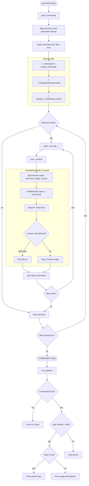

# Open Shell


A cross-platform shell whose pipeline carries **JSON**, not text.

Bash pipes text. PowerShell pipes .NET objects. Open Shell pipes JSON records —
so every stage is structured, and the same pipeline works on Linux, macOS, and
Windows.

```text
oshell> ls -r . | where .size > 10kb | sort-by .size --desc | take 5
```

Status: **0.0.1** (pre-alpha). Python 3.12+, standard library only.

The PyPI name is `open-shell-ai` (`openshell` and `open-shell` are taken). The
command you run is `openshell`.

```bash
pip install open-shell-ai
openshell --version
```

From this repo, without publishing:

```bash
python3 -m venv .venv
.venv/bin/pip install -e .
.venv/bin/openshell -c 'help'
# or:  ./openshell.py -c 'help'
```

`pip` ships the **core + basic commands**. Extra and advanced commands are not
on PyPI — they live on the website registry.

## Quick start

```bash
# Interactive shell
openshell

# One pipeline, then exit
openshell -c 'ls'
openshell -c 'ls -r . | where .size > 10kb | sort-by .size --desc | take 5'
openshell -c 'help | select .name .summary'

# Force NDJSON (also the default when stdout is not a TTY)
openshell --json -c 'ls | select .name .size'

# Works inside bash / jq
openshell -c 'ls | select .name .size' | jq .name
```

On a terminal, the last stage renders a table. When piped, it writes one JSON
object per line (NDJSON).

## How the pipeline works

Each command **yields records**. Only sinks (`to json`, `to table`) print.
`|` passes the record stream downstream. `take 5` stops early, so
`ls -r /usr | take 3` does not walk the whole tree.

```text
ls -r .          →  {name, path, is_dir, size, modified} …
     | where .size > 10kb
     | sort-by .size --desc
     | take 5
     | select .name .size
     | to table
```

Predicates use a leading dot for fields. Size units (`10kb`, `1mb`) and
`=~` (regex) are built in:

```text
where .size > 10mb
where .name =~ "\.py$"
where .is_dir
```

Errors are records, never raw tracebacks:

```text
{"$t": "error", "code": "cmd.not_found", "message": "…", "hint": "…"}
```

## Basic commands (ship with pip)

| Command | Usage | What it does |
|---|---|---|
| `pwd` | `pwd` | Print the working directory |
| `ls` | `ls [PATH …] [-r] [-a] [-l]` | List files as records |
| `cd` | `cd [PATH]` | Change the working directory |
| `mkdir` | `mkdir [-p] PATH …` | Create directories |
| `cp` | `cp [-r] SRC … DEST` | Copy files or directories |
| `mv` | `mv SRC … DEST` | Move or rename files |
| `rm` | `rm [-r] [-f] PATH …` | Remove files or directories |
| `cat` | `cat FILE …` | Read files as line records |
| `less` | `less [-n N] FILE` | First N lines (default 20) |
| `head` | `head [-n N] FILE` | First N lines (default 10) |
| `tail` | `tail [-n N] FILE` | Last N lines (default 10) |
| `grep` | `grep [-i] PATTERN FILE …` | Search files for a pattern |
| `find` | `find [PATH] [-name GLOB] [-type f\|d] [-size SIZE] [-mtime DAYS]` | Search for files |
| `ps` | `ps [aux]` | List running processes |
| `top` / `htop` | `top [-n N]` | List processes by CPU usage |
| `kill` | `kill [-SIGNAL] PID …` | Terminate a process |
| `df` | `df [-h] [PATH …]` | Disk space usage |
| `du` | `du [-s] [-h] [PATH …]` | Directory disk usage |
| `where` | `where .FIELD [OP VALUE]` | Filter (`>`, `<`, `==`, `!=`, `>=`, `<=`, `=~`) |
| `select` | `select .FIELD …` | Keep named fields |
| `sort-by` | `sort-by .FIELD [--desc]` | Sort (buffers the stream) |
| `take` | `take N` | First N records |
| `substring` | `substring .FIELD START [END]` | Slice a string field (Python indexes) |
| `to` | `to json\|table [--compact]` | Render the stream |
| `help` | `help [NAME]` | List loaded commands as records |
| `history` | `history [N]` | Previously run commands (JSON log at `~/.openshell_history`) |
| `command` | `command` | Same idea: every command as a record |
| `reload` | `reload` | Re-read every command `*.py` from disk |
| `version` | `version` | Version and runtime |
| `search` | `search [QUERY]` | List extras on the website registry |
| `install` | `install NAME` | Download an extra into `~/.config/oshell/command/` |
| `remove` | `remove NAME` | Remove a website extra (not a built-in) |

`help` itself is a source command, so this works:

```bash
openshell -c 'help | select .name .usage .origin'
```

## Website extras (not on PyPI)

Host the `registry/` folder so this URL exists:

`https://openshell.dev/registry/index.json`

```bash
openshell -c 'search'
openshell -c 'install count'
openshell -c 'ls | count'
openshell -c 'remove count'
```

Until the site is live, use the copy in this repo:

```bash
export OSHELL_REGISTRY_URL="file://$PWD/registry"
openshell -c 'search | to table'
openshell -c 'install uniq'
```

Current extras in `registry/`:

| Command | Usage | What it does |
|---|---|---|
| `count` | `count` | Count incoming records |
| `uniq` | `uniq [.FIELD]` | Drop consecutive duplicates |

`install` writes `~/.config/oshell/command/<file>.py` and checks the `sha256`
in `registry/index.json`. Built-ins cannot be removed.

## Writing a command

One file per command. Drop it in `command/` (basic, ships with pip) or
`registry/commands/` (website extra). The **decorator** is the name, not the
filename: `sort_by.py` registers `sort-by`.

```python
from openshell import Records, command

@command("greet", "Say hello as a record", "greet [NAME]", source=True)
def greet(_input: Records, args: list[str]) -> Records:
    yield {"hello": args[0] if args else "world"}

@greet.help
def greet_help():
    print("greet [NAME]")
    print("  Say hello as a JSON record. NAME defaults to world.")
```

Every command accepts `--help` (`-h` is left for real flags such as `df -h`).
If you do not define a help function, Open Shell prints the summary, usage,
and every option mentioned in the usage string. Define one with `@fn.help`
to print your own text instead.

No registration step. Files starting with `_` are skipped. A broken file is
reported and skipped; it does not kill the shell.

User-local commands (no install):

```text
~/.config/oshell/command/my_cmd.py
```

Or any directory on `$OSHELL_COMMAND_PATH` (separated by `os.pathsep`).

Load order, later wins on a name clash:

1. `<install>/oshell_command/*.py` — basic set from pip
2. `~/.config/oshell/command/*.py` — website extras and your files
3. `$OSHELL_COMMAND_PATH`

How commands load, and how `@command` / `@fn.help` hook into the registry:



## CLI

```text
openshell                 start the interactive shell
openshell -c PIPELINE     run one pipeline and exit
openshell --json -c ...   force NDJSON output
openshell --version
openshell --help
```

| Variable | Meaning |
|---|---|
| `OSHELL_REGISTRY_URL` | Catalog root (default `https://openshell.dev/registry`) |
| `OSHELL_COMMAND_PATH` | Extra command directories |
| `NO_COLOR` | Disable ANSI color |

## Repository

```text
openshell.py              core: registry, loader, pipeline, REPL
command/                  basic commands (shipped on PyPI)
registry/                 website extras (not in the wheel)
  index.json              catalog + sha256
  commands/*.py           one extra command per file
skills/                   design plan and build steps
image/                    banner
```

The repo folder is `command/`. It installs as `oshell_command/` so it does not
squat the name `command` in `site-packages`.

## Publish

```bash
pip install build twine
rm -rf dist
python -m build
twine upload dist/*
```

Confirm extras stayed off the wheel:

```bash
unzip -l dist/open_shell_ai-*.whl | grep -E 'count|uniq|registry' || echo ok
```

Then upload `registry/` to `https://openshell.dev/registry`.

## License

Apache-2.0
