# Open Shell call graph

Function-to-function calls extracted from AST of every command file, registry extra, and `openshell.py`.

Rules:

- Nested functions are qualified as `outer.inner`.
- Only **direct** calls in a function body are listed (decorators and nested function bodies are excluded).
- Call names are as written in source, not fully resolved through aliases.
- Tags: *(local)* same file, *(openshell)* imported `openshell` API, *(builtin)* Python builtin, otherwise stdlib/other.

## Files

- `command/ai.py` — commands: `ai`
- `command/cat.py` — commands: `cat`
- `command/cd.py` — commands: `cd`
- `command/command.py` — commands: `command`
- `command/cp.py` — commands: `cp`
- `command/df.py` — commands: `df`
- `command/du.py` — commands: `du`
- `command/env.py` — commands: `env`
- `command/find.py` — commands: `find`
- `command/grep.py` — commands: `grep`
- `command/head.py` — commands: `head`
- `command/help.py` — commands: `help`, `?`
- `command/history.py` — commands: `history`
- `command/install.py` — commands: `install`
- `command/json.py` — commands: `json`
- `command/kill.py` — commands: `kill`
- `command/less.py` — commands: `less`
- `command/ls.py` — commands: `ls`
- `command/mkdir.py` — commands: `mkdir`
- `command/mv.py` — commands: `mv`
- `command/ps.py` — commands: `ps`
- `command/pwd.py` — commands: `pwd`
- `command/reload.py` — commands: `reload`
- `command/remove.py` — commands: `remove`
- `command/rm.py` — commands: `rm`
- `command/search.py` — commands: `search`
- `command/select.py` — commands: `select`
- `command/sort.py` — commands: `sort`
- `command/substring.py` — commands: `substring`
- `command/tail.py` — commands: `tail`
- `command/take.py` — commands: `take`
- `command/to.py` — commands: `to`
- `command/top.py` — commands: `top`, `htop`
- `command/version.py` — commands: `version`
- `command/where.py` — commands: `where`
- `registry/commands/count.py` — commands: `count`
- `registry/commands/uniq.py` — commands: `uniq`
- `openshell.py`

## Command handlers → callees

Each registered command’s handler and the functions it calls in its body.

## Core pipeline (`openshell.py`)

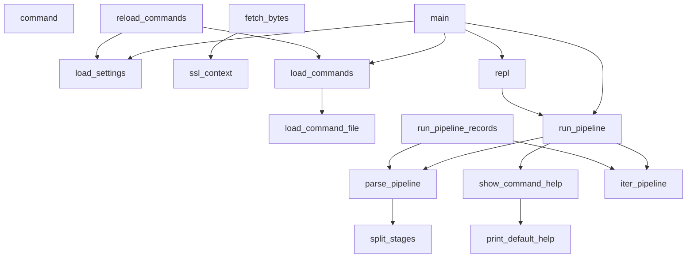

## `command/ai.py`

Imports:

- `from __future__ import annotations`
- `import json`
- `import os`
- `import re`
- `import urllib.error`
- `import urllib.request`
- `from openshell import COMMANDS, Json, Records, SETTINGS, ShellError, command, run_pipeline_records, ssl_context`

Registered commands: `ai`

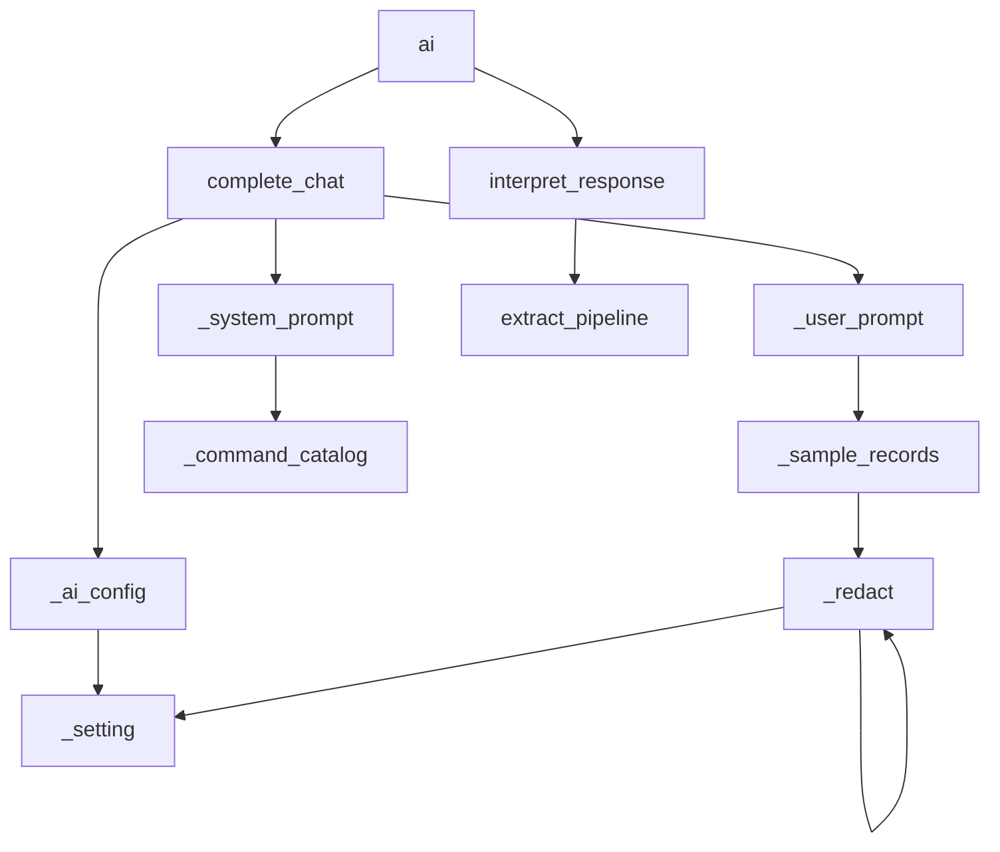

### `_setting`  (line 39)

Calls:

- `SETTINGS.get` (L41) *(openshell)*
- `str().strip` (L44)
- `str` (L44) *(builtin)*

### `_ai_config`  (line 50)

Calls:

- `_setting().lower` (L51)
- `_setting` (L51) *(local)*
- `ShellError` (L53) *(openshell)*
- `PROVIDERS.get` (L55)
- `join` (L57)
- `sorted` (L57) *(builtin)*
- `ShellError` (L58) *(openshell)*
- `_setting` (L60) *(local)*
- `ShellError` (L62) *(openshell)*
- `_setting` (L64) *(local)*
- `DEFAULT_MODELS.get` (L64)
- `ShellError` (L66) *(openshell)*

### `_command_catalog`  (line 71)

Calls:

- `sorted` (L73) *(builtin)*
- `lines.append` (L77)
- `join` (L78)

### `_redact`  (line 81)

Calls:

- `SECRET_NAME_RE.search` (L82)
- `str` (L82) *(builtin)*
- `isinstance` (L84) *(builtin)*
- `_redact` (L85) *(local)*
- `value.items` (L85)
- `isinstance` (L86) *(builtin)*
- `_redact` (L87) *(local)*
- `_setting` (L88) *(local)*
- `isinstance` (L89) *(builtin)*
- `value.replace` (L90)

### `_sample_records`  (line 94)

Calls:

- `_redact` (L95) *(local)*

### `_system_prompt`  (line 98)

Calls:

- `_command_catalog` (L112) *(local)*

### `_user_prompt`  (line 116)

Calls:

- `os.getcwd` (L117)
- `os.path.expanduser` (L118)
- `cwd.startswith` (L119)
- `len` (L120) *(builtin)*
- `len` (L124) *(builtin)*
- `isinstance` (L128) *(builtin)*
- `list` (L128) *(builtin)*
- `incoming[].keys` (L128)
- `_sample_records` (L129) *(local)*
- `json.dumps` (L130)

### `complete_chat`  (line 133)

Calls:

- `_ai_config` (L134) *(local)*
- `_system_prompt` (L139) *(local)*
- `bool` (L139) *(builtin)*
- `_user_prompt` (L140) *(local)*
- `urllib.request.Request` (L143)
- `json.dumps().encode` (L145)
- `json.dumps` (L145)
- `urllib.request.urlopen` (L154)
- `ssl_context` (L154) *(openshell)*
- `response.read` (L155)
- `err.read` (L157)
- `ShellError` (L158) *(openshell)*
- `ShellError` (L161) *(openshell)*
- `json.loads` (L164)
- `raw.decode` (L164)
- `ShellError` (L167) *(openshell)*
- `isinstance` (L169) *(builtin)*
- `join` (L170)
- `isinstance` (L171) *(builtin)*
- `part.get` (L171)
- `str` (L171) *(builtin)*
- `isinstance` (L173) *(builtin)*
- `content.strip` (L173)
- `ShellError` (L174) *(openshell)*

### `extract_pipeline`  (line 179)

Calls:

- `text.strip` (L180)
- `stripped.startswith` (L181)
- `stripped.splitlines` (L182)
- `line.strip().startswith` (L185)
- `line.strip` (L185)
- `inner.append` (L187)
- `join().strip` (L188)
- `join` (L188)
- `stripped.splitlines` (L189)
- `line.strip().strip` (L190)
- `line.strip` (L190)
- `line.startswith` (L191)
- `re.sub` (L192)
- `ShellError` (L193) *(openshell)*

### `interpret_response`  (line 197)

Calls:

- `text.strip` (L198)
- `stripped.startswith` (L199)
- `json.loads` (L201)
- `isinstance` (L204) *(builtin)*
- `stripped.startswith` (L206)
- `stripped.splitlines` (L209)
- `line.strip` (L210)
- `records.append` (L212)
- `json.loads` (L212)
- `extract_pipeline` (L217) *(local)*
- `run_pipeline_records` (L218) *(openshell)*

### `ai`  (line 228)

Decorators: `command('ai', …)`

Calls:

- `join().strip` (L229)
- `join` (L229)
- `ShellError` (L231) *(openshell)*
- `list` (L233) *(builtin)*
- `complete_chat` (L234) *(local)*
- `interpret_response` (L235) *(local)*

### `ai_help`  (line 239)

Decorators: `ai.help`

Calls:

- `print` (L240) *(builtin)*
- `print` (L241) *(builtin)*
- `print` (L242) *(builtin)*
- `print` (L243) *(builtin)*
- `print` (L244) *(builtin)*
- `print` (L245) *(builtin)*
- `print` (L246) *(builtin)*

## `command/cat.py`

Imports:

- `from __future__ import annotations`
- `from openshell import Records, ShellError, command, expand_path, iter_file_lines`

Registered commands: `cat`

### `cat`  (line 9)

Decorators: `command('cat', …)`

Calls:

- `ShellError` (L11) *(openshell)*
- `iter_file_lines` (L14) *(openshell)*
- `expand_path` (L14) *(openshell)*

## `command/cd.py`

Imports:

- `from __future__ import annotations`
- `import os`
- `from pathlib import Path`
- `from openshell import Records, ShellError, command, expand_path`

Registered commands: `cd`

### `cd`  (line 12)

Decorators: `command('cd', …)`

Calls:

- `expand_path` (L13) *(openshell)*
- `Path.home` (L13)
- `target.exists` (L14)
- `ShellError` (L15) *(openshell)*
- `target.is_dir` (L17)
- `ShellError` (L18) *(openshell)*
- `os.chdir` (L21)
- `ShellError` (L23) *(openshell)*
- `target.is_absolute` (L25)
- `os.path.normpath` (L26)
- `str` (L26) *(builtin)*
- `os.environ.get` (L28)
- `os.getcwd` (L28)
- `os.path.normpath` (L29)
- `os.path.join` (L29)
- `str` (L29) *(builtin)*
- `Path` (L31)
- `str` (L32) *(builtin)*

## `command/command.py`

Imports:

- `from __future__ import annotations`
- `from openshell import COMMANDS, Records, command`

Registered commands: `command`

### `list_commands`  (line 9)

Decorators: `command('command', …)`

Calls:

- `sorted` (L10) *(builtin)*

## `command/cp.py`

Imports:

- `from __future__ import annotations`
- `import shutil`
- `from openshell import Records, ShellError, command, expand_path, file_record, parse_args`

Registered commands: `cp`

### `cp`  (line 11)

Decorators: `command('cp', …)`

Calls:

- `parse_args` (L12) *(openshell)*
- `len` (L16) *(builtin)*
- `ShellError` (L17) *(openshell)*
- `expand_path` (L19) *(openshell)*
- `expand_path` (L20) *(openshell)*
- `len` (L22) *(builtin)*
- `dest.is_dir` (L24)
- `ShellError` (L25) *(openshell)*
- `source.exists` (L29)
- `ShellError` (L30) *(openshell)*
- `source.is_dir` (L32)
- `ShellError` (L33) *(openshell)*
- `dest.is_dir` (L35)
- `source.is_dir` (L37)
- `shutil.copytree` (L38)
- `target.parent.exists` (L40)
- `ShellError` (L41) *(openshell)*
- `shutil.copy2` (L43)
- `ShellError` (L47) *(openshell)*
- `file_record` (L49) *(openshell)*

## `command/df.py`

Imports:

- `from __future__ import annotations`
- `import shutil`
- `from openshell import Records, command, expand_path, human_size, parse_args`

Registered commands: `df`

### `df`  (line 11)

Decorators: `command('df', …)`

Calls:

- `parse_args` (L12) *(openshell)*
- `expand_path` (L17) *(openshell)*
- `shutil.disk_usage` (L21)
- `int` (L25) *(builtin)*
- `round` (L25) *(builtin)*
- `str` (L27) *(builtin)*
- `human_size` (L34) *(openshell)*
- `human_size` (L35) *(openshell)*
- `human_size` (L36) *(openshell)*

## `command/du.py`

Imports:

- `from __future__ import annotations`
- `from pathlib import Path`
- `from openshell import Records, ShellError, command, expand_path, human_size, parse_args`

Registered commands: `du`

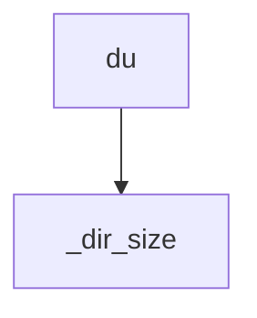

### `_dir_size`  (line 10)

Calls:

- `path.is_file` (L11)
- `path.stat` (L13)
- `path.rglob` (L17)
- `child.is_file` (L19)
- `child.stat` (L20)

### `du`  (line 27)

Decorators: `command('du', …)`

Calls:

- `parse_args` (L28) *(openshell)*
- `expand_path` (L37) *(openshell)*
- `Path` (L37)
- `target.exists` (L40)
- `ShellError` (L41) *(openshell)*
- `target.is_file` (L43)
- `_dir_size` (L44) *(local)*
- `str` (L45) *(builtin)*
- `human_size` (L47) *(openshell)*
- `sorted` (L50) *(builtin)*
- `target.iterdir` (L50)
- `_dir_size` (L51) *(local)*
- `str` (L52) *(builtin)*
- `human_size` (L54) *(openshell)*

## `command/env.py`

Imports:

- `from __future__ import annotations`
- `from openshell import Records, SETTINGS, command`

Registered commands: `env`

### `env`  (line 9)

Decorators: `command('env', …)`

Calls:

- `sorted` (L10) *(builtin)*

## `command/find.py`

Imports:

- `from __future__ import annotations`
- `import time`
- `from fnmatch import fnmatch`
- `from pathlib import Path`
- `from openshell import Records, ShellError, command, expand_path, file_record, literal, parse_args`

Registered commands: `find`

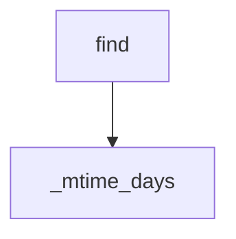

### `_mtime_days`  (line 14)

Calls:

- `time.time` (L15)
- `path.stat` (L15)

### `find`  (line 24)

Decorators: `command('find', …)`

Calls:

- `parse_args` (L25) *(openshell)*
- `expand_path` (L34) *(openshell)*
- `Path` (L34)
- `root.exists` (L35)
- `ShellError` (L36) *(openshell)*
- `opts.get` (L39)
- `opts.get` (L40)
- `ShellError` (L42) *(openshell)*
- `literal` (L47) *(openshell)*
- `isinstance` (L48) *(builtin)*
- `ShellError` (L49) *(openshell)*
- `float` (L55) *(builtin)*
- `ShellError` (L57) *(openshell)*
- `root.is_file` (L60)
- `root.rglob` (L60)
- `path.is_dir` (L63)
- `fnmatch` (L68)
- `path.stat` (L70)
- `_mtime_days` (L72) *(local)*
- `file_record` (L76) *(openshell)*

## `command/grep.py`

Imports:

- `from __future__ import annotations`
- `import re`
- `from typing import Any`
- `from openshell import Records, ShellError, command, expand_path, iter_file_lines, parse_args`

Registered commands: `grep`

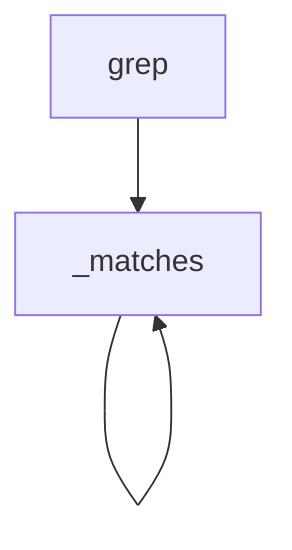

### `_matches`  (line 11)

Calls:

- `isinstance` (L12) *(builtin)*
- `pattern.search` (L13)
- `isinstance` (L14) *(builtin)*
- `any` (L15) *(builtin)*
- `_matches` (L15) *(local)*
- `value.values` (L15)
- `isinstance` (L16) *(builtin)*
- `any` (L17) *(builtin)*
- `_matches` (L17) *(local)*

### `grep`  (line 28)

Decorators: `command('grep', …)`

Calls:

- `parse_args` (L29) *(openshell)*
- `ShellError` (L34) *(openshell)*
- `re.compile` (L39)
- `ShellError` (L41) *(openshell)*
- `iter_file_lines` (L45) *(openshell)*
- `expand_path` (L45) *(openshell)*
- `pattern.search` (L46)
- `_matches` (L50) *(local)*

## `command/head.py`

Imports:

- `from __future__ import annotations`
- `from openshell import Records, ShellError, command, expand_path, iter_file_lines, parse_args`

Registered commands: `head`

### `head`  (line 9)

Decorators: `command('head', …)`

Calls:

- `parse_args` (L10) *(openshell)*
- `ShellError` (L15) *(openshell)*
- `int` (L20) *(builtin)*
- `ShellError` (L22) *(openshell)*
- `ShellError` (L25) *(openshell)*
- `iter_file_lines` (L28) *(openshell)*
- `expand_path` (L28) *(openshell)*

## `command/help.py`

Imports:

- `from __future__ import annotations`
- `from openshell import COMMANDS, Records, command`

Registered commands: `help`, `?`

### `help`  (line 14)

Decorators: `command('help', …)`, `command('?', …)`

Calls:

- `sorted` (L16) *(builtin)*

## `command/history.py`

Imports:

- `from __future__ import annotations`
- `import json`
- `from openshell import Records, ShellError, command, history_path`

Registered commands: `history`

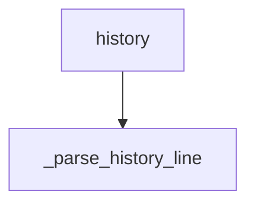

### `_parse_history_line`  (line 10)

Calls:

- `json.loads` (L12)
- `isinstance` (L15) *(builtin)*
- `record.get` (L18)
- `record.get` (L19)
- `record.get` (L20)

### `history`  (line 25)

Decorators: `command('history', …)`

Calls:

- `history_path` (L26) *(openshell)*
- `path.is_file` (L27)
- `path.read_text().splitlines` (L31)
- `path.read_text` (L31)
- `ShellError` (L33) *(openshell)*
- `int` (L39) *(builtin)*
- `ShellError` (L41) *(openshell)*
- `ShellError` (L44) *(openshell)*
- `max` (L48) *(builtin)*
- `len` (L48) *(builtin)*
- `enumerate` (L51) *(builtin)*
- `_parse_history_line` (L52) *(local)*

## `command/install.py`

Imports:

- `from __future__ import annotations`
- `from openshell import Records, ShellError, command, install_from_catalog`

Registered commands: `install`

### `install`  (line 10)

Decorators: `command('install', …)`

Calls:

- `len` (L11) *(builtin)*
- `ShellError` (L12) *(openshell)*
- `install_from_catalog` (L14) *(openshell)*

## `command/json.py`

Imports:

- `from __future__ import annotations`
- `from openshell import Records, ShellError, command, get_field, sort_key`

Registered commands: `json`

### `json`  (line 8)

Decorators: `command('json', …)`

Calls:

- `print` (L11) *(builtin)*
- `json.dumps` (L11)

## `command/kill.py`

Imports:

- `from __future__ import annotations`
- `import os`
- `import signal`
- `from openshell import Records, ShellError, command`

Registered commands: `kill`

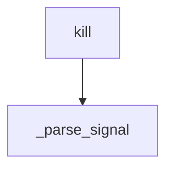

### `_parse_signal`  (line 18)

Calls:

- `text.lstrip().upper` (L19)
- `text.lstrip` (L19)
- `raw.startswith` (L20)
- `raw.isdigit` (L22)
- `int` (L23) *(builtin)*
- `int` (L25) *(builtin)*
- `ShellError` (L26) *(openshell)*

### `kill`  (line 31)

Decorators: `command('kill', …)`

Calls:

- `int` (L32) *(builtin)*
- `len` (L35) *(builtin)*
- `len` (L38) *(builtin)*
- `ShellError` (L39) *(openshell)*
- `_parse_signal` (L41) *(local)*
- `arg.startswith` (L44)
- `_parse_signal` (L45) *(local)*
- `pids.append` (L49)
- `int` (L49) *(builtin)*
- `ShellError` (L51) *(openshell)*
- `ShellError` (L56) *(openshell)*
- `os.kill` (L61)
- `ShellError` (L63) *(openshell)*
- `ShellError` (L66) *(openshell)*
- `ShellError` (L69) *(openshell)*

## `command/less.py`

Imports:

- `from __future__ import annotations`
- `from openshell import Records, ShellError, command, expand_path, iter_file_lines, parse_args`

Registered commands: `less`

### `less`  (line 9)

Decorators: `command('less', …)`

Calls:

- `parse_args` (L10) *(openshell)*
- `ShellError` (L15) *(openshell)*
- `int` (L20) *(builtin)*
- `ShellError` (L22) *(openshell)*
- `ShellError` (L25) *(openshell)*
- `iter_file_lines` (L28) *(openshell)*
- `expand_path` (L28) *(openshell)*

## `command/ls.py`

Imports:

- `from __future__ import annotations`
- `from pathlib import Path`
- `from openshell import Records, ShellError, command, expand_path, file_record, parse_args`

Registered commands: `ls`

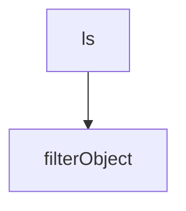

### `ls`  (line 11)

Decorators: `command('ls', …)`

Calls:

- `parse_args` (L12) *(openshell)*
- `expand_path` (L20) *(openshell)*
- `Path` (L20)
- `target.exists` (L25)
- `ShellError` (L26) *(openshell)*
- `target.is_file` (L28)
- `file_record` (L29) *(openshell)*
- `filterObject` (L30) *(local)*
- `target.rglob` (L34)
- `target.iterdir` (L34)
- `sorted` (L35) *(builtin)*
- `path.name.startswith` (L36)
- `file_record` (L38) *(openshell)*
- `filterObject` (L39) *(local)*

### `filterObject`  (line 43)

Calls: _(none)_

### `ls_help`  (line 49)

Decorators: `ls.help`

Calls:

- `print` (L50) *(builtin)*
- `print` (L51) *(builtin)*
- `print` (L52) *(builtin)*
- `print` (L53) *(builtin)*
- `print` (L54) *(builtin)*
- `print` (L55) *(builtin)*

## `command/mkdir.py`

Imports:

- `from __future__ import annotations`
- `from openshell import Records, ShellError, command, expand_path, file_record, parse_args`

Registered commands: `mkdir`

### `mkdir`  (line 9)

Decorators: `command('mkdir', …)`

Calls:

- `parse_args` (L10) *(openshell)*
- `ShellError` (L15) *(openshell)*
- `expand_path` (L19) *(openshell)*
- `path.mkdir` (L21)
- `ShellError` (L23) *(openshell)*
- `ShellError` (L26) *(openshell)*
- `file_record` (L28) *(openshell)*

## `command/mv.py`

Imports:

- `from __future__ import annotations`
- `import shutil`
- `from openshell import Records, ShellError, command, expand_path, file_record`

Registered commands: `mv`

### `mv`  (line 11)

Decorators: `command('mv', …)`

Calls:

- `len` (L12) *(builtin)*
- `ShellError` (L13) *(openshell)*
- `expand_path` (L15) *(openshell)*
- `expand_path` (L16) *(openshell)*
- `len` (L17) *(builtin)*
- `dest.is_dir` (L19)
- `ShellError` (L20) *(openshell)*
- `source.exists` (L24)
- `ShellError` (L25) *(openshell)*
- `dest.is_dir` (L27)
- `shutil.move` (L29)
- `str` (L29) *(builtin)*
- `ShellError` (L31) *(openshell)*
- `file_record` (L33) *(openshell)*

## `command/ps.py`

Imports:

- `from __future__ import annotations`
- `from openshell import Records, command, iter_processes, parse_args`

Registered commands: `ps`

### `ps`  (line 9)

Decorators: `command('ps', …)`

Calls:

- `arg.startswith` (L12)
- `arg.isalpha` (L12)
- `set` (L12) *(builtin)*
- `normalized.append` (L13)
- `normalized.append` (L15)
- `parse_args` (L16) *(openshell)*
- `iter_processes` (L23) *(openshell)*

## `command/pwd.py`

Imports:

- `from __future__ import annotations`
- `import os`
- `from pathlib import Path`
- `from openshell import Records, command`

Registered commands: `pwd`

### `pwd`  (line 12)

Decorators: `command('pwd', …)`

Calls:

- `os.environ.get` (L13)
- `Path` (L14)
- `Path.cwd` (L14)
- `os.path.samefile` (L16)
- `os.getcwd` (L16)
- `Path.cwd` (L17)
- `Path.cwd` (L19)
- `str` (L20) *(builtin)*

## `command/reload.py`

Imports:

- `from __future__ import annotations`
- `from openshell import COMMANDS, Records, command, reload_commands`

Registered commands: `reload`

### `reload`  (line 9)

Decorators: `command('reload', …)`

Calls:

- `reload_commands` (L10) *(openshell)*
- `err.to_record` (L21)

## `command/remove.py`

Imports:

- `from __future__ import annotations`
- `from openshell import Records, ShellError, command, remove_user_command`

Registered commands: `remove`

### `remove`  (line 9)

Decorators: `command('remove', …)`

Calls:

- `len` (L10) *(builtin)*
- `ShellError` (L11) *(openshell)*
- `remove_user_command` (L13) *(openshell)*

## `command/rm.py`

Imports:

- `from __future__ import annotations`
- `import shutil`
- `from openshell import Records, ShellError, command, expand_path, parse_args`

Registered commands: `rm`

### `rm`  (line 11)

Decorators: `command('rm', …)`

Calls:

- `parse_args` (L12) *(openshell)*
- `ShellError` (L20) *(openshell)*
- `expand_path` (L26) *(openshell)*
- `path.exists` (L27)
- `ShellError` (L30) *(openshell)*
- `path.is_dir` (L33)
- `path.is_symlink` (L33)
- `ShellError` (L35) *(openshell)*
- `shutil.rmtree` (L37)
- `path.unlink` (L39)
- `ShellError` (L45) *(openshell)*
- `str` (L47) *(builtin)*

## `command/search.py`

Imports:

- `from __future__ import annotations`
- `from openshell import COMMANDS, Records, command, fetch_catalog, user_command_dir`

Registered commands: `search`

### `search`  (line 9)

Decorators: `command('search', …)`

Calls:

- `join().lower` (L10)
- `join` (L10)
- `user_command_dir` (L11) *(openshell)*
- `fetch_catalog` (L12) *(openshell)*
- `isinstance` (L13) *(builtin)*
- `str` (L15) *(builtin)*
- `entry.get` (L15)
- `str` (L16) *(builtin)*
- `entry.get` (L16)
- `name.lower` (L17)
- `summary.lower` (L17)
- `str().split` (L19)
- `str` (L19) *(builtin)*
- `entry.get` (L19)
- `entry.get` (L23)
- `entry.get` (L24)
- `is_file` (L25)
- `entry.get` (L26)

## `command/select.py`

Imports:

- `from __future__ import annotations`
- `from openshell import Records, ShellError, command, get_field`

Registered commands: `select`

### `select`  (line 9)

Decorators: `command('select', …)`

Calls:

- `ShellError` (L11) *(openshell)*
- `arg.lstrip` (L13)
- `field.split` (L15)
- `get_field` (L15) *(openshell)*

## `command/sort.py`

Imports:

- `from __future__ import annotations`
- `from openshell import Records, ShellError, command, get_field, sort_key`

Registered commands: `sort`

### `sort`  (line 9)

Decorators: `command('sort', …)`

Calls:

- `arg.startswith` (L15)
- `arg.lstrip` (L16)
- `ShellError` (L18) *(openshell)*
- `ShellError` (L21) *(openshell)*
- `sorted` (L24) *(builtin)*

## `command/substring.py`

Imports:

- `from __future__ import annotations`
- `from openshell import Json, Records, ShellError, command, get_field`

Registered commands: `substring`

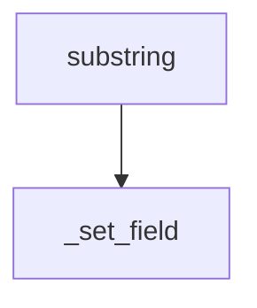

### `_set_field`  (line 8)

Calls:

- `path.split` (L9)
- `dict` (L10) *(builtin)*
- `len` (L11) *(builtin)*
- `isinstance` (L16) *(builtin)*
- `current.get` (L16)
- `isinstance` (L17) *(builtin)*
- `dict` (L17) *(builtin)*

### `substring`  (line 26)

Decorators: `command('substring', …)`

Calls:

- `len` (L27) *(builtin)*
- `ShellError` (L28) *(openshell)*
- `args[].lstrip` (L30)
- `ShellError` (L32) *(openshell)*
- `int` (L35) *(builtin)*
- `len` (L36) *(builtin)*
- `int` (L36) *(builtin)*
- `ShellError` (L38) *(openshell)*
- `get_field` (L42) *(openshell)*
- `str` (L43) *(builtin)*
- `isinstance` (L45) *(builtin)*
- `_set_field` (L46) *(local)*

## `command/tail.py`

Imports:

- `from __future__ import annotations`
- `from collections import deque`
- `from openshell import Records, ShellError, command, expand_path, iter_file_lines, parse_args`

Registered commands: `tail`

### `tail`  (line 11)

Decorators: `command('tail', …)`

Calls:

- `parse_args` (L12) *(openshell)*
- `ShellError` (L18) *(openshell)*
- `ShellError` (L21) *(openshell)*
- `int` (L26) *(builtin)*
- `ShellError` (L28) *(openshell)*
- `ShellError` (L31) *(openshell)*
- `deque` (L33)
- `iter_file_lines` (L34) *(openshell)*
- `expand_path` (L34) *(openshell)*
- `buffer.append` (L35)

## `command/take.py`

Imports:

- `from __future__ import annotations`
- `from openshell import Records, ShellError, command`

Registered commands: `take`

### `take`  (line 9)

Decorators: `command('take', …)`

Calls:

- `len` (L10) *(builtin)*
- `args[].isdigit` (L10)
- `ShellError` (L11) *(openshell)*
- `int` (L12) *(builtin)*
- `enumerate` (L13) *(builtin)*

## `command/to.py`

Imports:

- `from __future__ import annotations`
- `import json`
- `import sys`
- `from openshell import Json, Records, ShellError, command, use_color`

Registered commands: `to`

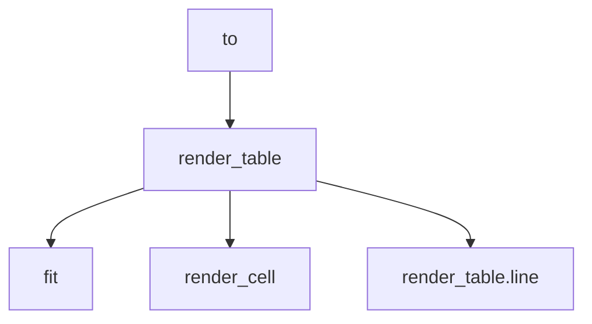

### `render_cell`  (line 17)

Calls:

- `isinstance` (L20) *(builtin)*
- `isinstance` (L22) *(builtin)*
- `json.dumps` (L23)
- `str` (L24) *(builtin)*

### `fit`  (line 27)

Calls:

- `len` (L29) *(builtin)*

### `render_table`  (line 32)

Calls:

- `all` (L33) *(builtin)*
- `isinstance` (L33) *(builtin)*
- `sys.stdout.write` (L35)
- `json.dumps` (L35)
- `columns.append` (L42)
- `fit` (L44) *(local)*
- `render_cell` (L44) *(local)*
- `row.get` (L44)
- `max` (L45) *(builtin)*
- `len` (L45) *(builtin)*
- `all` (L47) *(builtin)*
- `isinstance` (L47) *(builtin)*
- `row.get` (L47)
- `row.get` (L48)
- `line` (L60) *(local)*
- `line` (L61) *(local)*
- `line` (L63) *(local)*
- `sys.stdout.write` (L64)
- `len` (L64) *(builtin)*

### `render_table.line`  (line 52)

Calls:

- `values[].rjust` (L53)
- `values[].ljust` (L53)
- `join().rstrip` (L55)
- `join` (L55)
- `use_color` (L56) *(openshell)*
- `sys.stdout.write` (L58)

### `to`  (line 68)

Decorators: `command('to', …)`

Calls:

- `sys.stdout.write` (L75)
- `json.dumps` (L76)
- `list` (L78) *(builtin)*
- `render_table` (L80) *(local)*
- `sys.stdout.write` (L82)
- `ShellError` (L84) *(openshell)*

## `command/top.py`

Imports:

- `from __future__ import annotations`
- `from openshell import Records, ShellError, command, iter_processes, parse_args`

Registered commands: `top`, `htop`

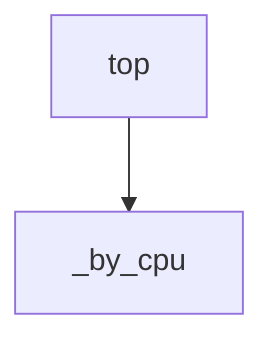

### `_by_cpu`  (line 8)

Calls:

- `list` (L9) *(builtin)*
- `rows.sort` (L10)

### `top`  (line 16)

Decorators: `command('top', …)`, `command('htop', …)`

Calls:

- `parse_args` (L17) *(openshell)*
- `int` (L24) *(builtin)*
- `ShellError` (L26) *(openshell)*
- `_by_cpu` (L28) *(local)*
- `iter_processes` (L28) *(openshell)*

## `command/version.py`

Imports:

- `from __future__ import annotations`
- `import sys`
- `from openshell import COMMANDS, Records, __version__, command`

Registered commands: `version`

### `version`  (line 11)

Decorators: `command('version', …)`

Calls:

- `sys.version.split` (L15)
- `len` (L17) *(builtin)*

## `command/where.py`

Imports:

- `from __future__ import annotations`
- `import re`
- `from openshell import Records, ShellError, command, get_field, literal`

Registered commands: `where`

### `where`  (line 16)

Decorators: `command('where', …)`

Calls:

- `join().strip` (L17)
- `join` (L17)
- `PREDICATE_RE.match` (L18)
- `ShellError` (L20) *(openshell)*
- `match.group` (L23)
- `match.group` (L24)
- `literal` (L25) *(openshell)*
- `re.compile` (L26)
- `str` (L26) *(builtin)*
- `get_field` (L29) *(openshell)*
- `bool` (L31) *(builtin)*
- `pattern.search` (L33)
- `str` (L33) *(builtin)*

## `registry/commands/count.py`

Imports:

- `from __future__ import annotations`
- `from openshell import Records, command`

Registered commands: `count`

### `count`  (line 9)

Decorators: `command('count', …)`

Calls: _(none)_

## `registry/commands/uniq.py`

Imports:

- `from __future__ import annotations`
- `from openshell import Records, command, get_field`

Registered commands: `uniq`

### `uniq`  (line 9)

Decorators: `command('uniq', …)`

Calls:

- `args[].lstrip` (L10)
- `object` (L11) *(builtin)*
- `get_field` (L13) *(openshell)*

## `openshell.py`

Imports:

- `from __future__ import annotations`
- `import hashlib`
- `import importlib.util`
- `import inspect`
- `import json`
- `import os`
- `import re`
- `import shlex`
- `import ssl`
- `import sys`
- `import urllib.error`
- `import urllib.parse`
- `import urllib.request`
- `from dataclasses import dataclass, field`
- `from datetime import datetime`
- `from pathlib import Path`
- `from typing import Any, Callable, Iterator`

```mermaid
flowchart TD
  openshell_py_print_error["print_error"]
  openshell_py_use_color["use_color"]
  openshell_py_print_error --> openshell_py_use_color
  openshell_py_print_warning["print_warning"]
  openshell_py_print_warning --> openshell_py_use_color
  openshell_py_print_default_help["print_default_help"]
  openshell_py_command_options["command_options"]
  openshell_py_print_default_help --> openshell_py_command_options
  openshell_py_show_command_help["show_command_help"]
  openshell_py_show_command_help --> openshell_py_print_default_help
  openshell_py_load_settings["load_settings"]
  openshell_py_env_path["env_path"]
  openshell_py_load_settings --> openshell_py_env_path
  openshell_py_append_history["append_history"]
  openshell_py_history_path["history_path"]
  openshell_py_append_history --> openshell_py_history_path
  openshell_py_command_dirs["command_dirs"]
  openshell_py_user_command_dir["user_command_dir"]
  openshell_py_command_dirs --> openshell_py_user_command_dir
  openshell_py_join_registry["join_registry"]
  openshell_py_registry_root["registry_root"]
  openshell_py_join_registry --> openshell_py_registry_root
  openshell_py_fetch_bytes["fetch_bytes"]
  openshell_py_ssl_context["ssl_context"]
  openshell_py_fetch_bytes --> openshell_py_ssl_context
  openshell_py_fetch_catalog["fetch_catalog"]
  openshell_py_fetch_catalog --> openshell_py_fetch_bytes
  openshell_py_fetch_catalog --> openshell_py_join_registry
  openshell_py_fetch_registry_file["fetch_registry_file"]
  openshell_py_fetch_registry_file --> openshell_py_fetch_bytes
  openshell_py_fetch_registry_file --> openshell_py_join_registry
  openshell_py_catalog_entry["catalog_entry"]
  openshell_py_catalog_entry --> openshell_py_fetch_catalog
  openshell_py_install_from_catalog["install_from_catalog"]
  openshell_py_install_from_catalog --> openshell_py_catalog_entry
  openshell_py_install_from_catalog --> openshell_py_fetch_registry_file
  openshell_py_install_from_catalog --> openshell_py_user_command_dir
  openshell_py_install_from_catalog --> openshell_py_registry_root
  openshell_py_remove_user_command["remove_user_command"]
  openshell_py_remove_user_command --> openshell_py_user_command_dir
  openshell_py_load_commands["load_commands"]
  openshell_py_load_commands --> openshell_py_command_dirs
  openshell_py_load_command_file["load_command_file"]
  openshell_py_load_commands --> openshell_py_load_command_file
  openshell_py_reload_commands["reload_commands"]
  openshell_py_reload_commands --> openshell_py_load_settings
  openshell_py_reload_commands --> openshell_py_load_commands
  openshell_py_file_record["file_record"]
  openshell_py_format_datetime["format_datetime"]
  openshell_py_file_record --> openshell_py_format_datetime
  openshell_py_parse_pipeline["parse_pipeline"]
  openshell_py_split_stages["split_stages"]
  openshell_py_parse_pipeline --> openshell_py_split_stages
  openshell_py_run_pipeline_records["run_pipeline_records"]
  openshell_py_run_pipeline_records --> openshell_py_parse_pipeline
  openshell_py_iter_pipeline["iter_pipeline"]
  openshell_py_run_pipeline_records --> openshell_py_iter_pipeline
  openshell_py_run_pipeline["run_pipeline"]
  openshell_py_run_pipeline --> openshell_py_parse_pipeline
  openshell_py_run_pipeline --> openshell_py_show_command_help
  openshell_py_run_pipeline --> openshell_py_iter_pipeline
  openshell_py_run_pipeline --> openshell_py_append_history
  openshell_py_repl_prompt["repl_prompt"]
  openshell_py_repl_cwd["repl_cwd"]
  openshell_py_repl_prompt --> openshell_py_repl_cwd
  openshell_py_repl["repl"]
  openshell_py__notify_terminal_cwd["_notify_terminal_cwd"]
  openshell_py_repl --> openshell_py__notify_terminal_cwd
  openshell_py_repl --> openshell_py_repl_prompt
  openshell_py_repl --> openshell_py_run_pipeline
  openshell_py_repl --> openshell_py_print_error
  openshell_py_main["main"]
  openshell_py_main --> openshell_py_print_error
  openshell_py_main --> openshell_py_load_settings
  openshell_py_main --> openshell_py_load_commands
  openshell_py_main --> openshell_py_print_warning
  openshell_py_main --> openshell_py_repl
  openshell_py_main --> openshell_py_run_pipeline
```

### `ShellError.__init__`  (line 61)

Calls:

- `super().__init__` (L62)
- `super` (L62) *(builtin)*

### `ShellError.to_record`  (line 67)

Calls: _(none)_

### `use_color`  (line 74)

Calls:

- `stream.isatty` (L75)
- `os.environ.get` (L75)

### `print_error`  (line 78)

Calls:

- `use_color` (L79) *(local)*
- `sys.stderr.write` (L80)
- `sys.stderr.write` (L82)
- `sys.stderr.write` (L84)
- `json.dumps` (L84)
- `err.to_record` (L84)

### `print_warning`  (line 87)

Calls:

- `use_color` (L88) *(local)*
- `sys.stderr.write` (L89)
- `sys.stderr.write` (L91)

### `command_options`  (line 119)

Calls:

- `set` (L121) *(builtin)*
- `OPTION_TOKEN_RE.findall` (L123)
- `seen.add` (L125)
- `options.append` (L126)
- `options.append` (L128)

### `print_default_help`  (line 132)

Calls:

- `sys.stdout.write` (L134)
- `sys.stdout.write` (L135)
- `command_options` (L136) *(local)*
- `sys.stdout.write` (L137)
- `sys.stdout.write` (L140)

### `show_command_help`  (line 143)

Calls:

- `print_default_help` (L147) *(local)*
- `inspect.signature` (L149)
- `len` (L150) *(builtin)*
- `fn` (L150)
- `isinstance` (L153) *(builtin)*
- `str` (L153) *(builtin)*
- `sys.stdout.write` (L154)
- `text.endswith` (L154)

### `command`  (line 157)

Calls: _(none)_

### `command.register`  (line 164)

Calls:

- `Command` (L165)

### `command.register.help_decorator`  (line 167)

Calls:

- `COMMANDS.values` (L168) *(openshell)*

### `env_path`  (line 188)

Calls:

- `Path.home` (L190)

### `load_settings`  (line 193)

Calls:

- `SETTINGS.clear` (L195) *(openshell)*
- `env_path` (L196) *(local)*
- `path.exists` (L197)
- `path.open` (L200)
- `json.load` (L201)
- `ShellError` (L203) *(openshell)*
- `ShellError` (L206) *(openshell)*
- `isinstance` (L208) *(builtin)*
- `ShellError` (L209) *(openshell)*
- `SETTINGS.update` (L211) *(openshell)*

### `user_command_dir`  (line 215)

Calls:

- `Path.home` (L217)

### `history_path`  (line 223)

Calls:

- `os.environ.get` (L225)
- `Path().expanduser` (L227)
- `Path` (L227)
- `Path.home` (L228)

### `_StdoutCapture.__init__`  (line 234)

Calls: _(none)_

### `_StdoutCapture.write`  (line 240)

Calls:

- `self._original.write` (L241)
- `isinstance` (L242) *(builtin)*
- `str` (L242) *(builtin)*
- `self._chunks.append` (L245)
- `len` (L246) *(builtin)*

### `_StdoutCapture.flush`  (line 249)

Calls:

- `self._original.flush` (L250)

### `_StdoutCapture.isatty`  (line 252)

Calls:

- `self._original.isatty` (L253)

### `_StdoutCapture.__getattr__`  (line 255)

Calls:

- `getattr` (L256) *(builtin)*

### `_StdoutCapture.captured`  (line 258)

Calls:

- `join` (L259)

### `append_history`  (line 262)

Calls:

- `line.strip` (L264)
- `len` (L267) *(builtin)*
- `datetime.now().astimezone().isoformat` (L270)
- `datetime.now().astimezone` (L270)
- `datetime.now` (L270)
- `history_path` (L275) *(local)*
- `path.open` (L276)
- `handle.write` (L277)
- `json.dumps` (L277)

### `command_dirs`  (line 282)

Calls:

- `Path().resolve` (L284)
- `Path` (L284)
- `user_command_dir` (L288) *(local)*
- `os.environ.get` (L290)
- `Path().expanduser` (L291)
- `Path` (L291)
- `extra.split` (L291)

### `registry_root`  (line 295)

Calls:

- `os.environ.get().rstrip` (L296)
- `os.environ.get` (L296)

### `join_registry`  (line 299)

Calls:

- `registry_root` (L300) *(local)*
- `path.lstrip` (L301)

### `ssl_context`  (line 305)

Calls:

- `candidates.append` (L310)
- `certifi.where` (L310)
- `ssl.get_default_verify_paths` (L313)
- `candidates.extend` (L314)
- `set` (L322) *(builtin)*
- `seen.add` (L326)
- `Path().is_file` (L327)
- `Path` (L327)
- `ssl.create_default_context` (L328)
- `ssl.create_default_context` (L329)

### `fetch_bytes`  (line 332)

Calls:

- `urllib.parse.urlparse` (L333)
- `Path` (L335)
- `urllib.parse.unquote` (L335)
- `path.is_file` (L336)
- `ShellError` (L337) *(openshell)*
- `path.read_bytes` (L339)
- `ShellError` (L341) *(openshell)*
- `urllib.request.Request` (L343)
- `urllib.request.urlopen` (L346)
- `ssl_context` (L346) *(local)*
- `response.read` (L347)
- `ShellError` (L349) *(openshell)*
- `ShellError` (L353) *(openshell)*

### `fetch_catalog`  (line 358)

Calls:

- `fetch_bytes` (L359) *(local)*
- `join_registry` (L359) *(local)*
- `json.loads` (L361)
- `raw.decode` (L361)
- `ShellError` (L363) *(openshell)*
- `isinstance` (L364) *(builtin)*
- `catalog.get` (L364)
- `ShellError` (L365) *(openshell)*

### `fetch_registry_file`  (line 369)

Calls:

- `fetch_bytes` (L370) *(local)*
- `join_registry` (L370) *(local)*

### `catalog_entry`  (line 373)

Calls:

- `fetch_catalog` (L374) *(local)*
- `isinstance` (L375) *(builtin)*
- `entry.get` (L375)
- `ShellError` (L377) *(openshell)*

### `install_from_catalog`  (line 381)

Calls:

- `catalog_entry` (L382) *(local)*
- `str` (L383) *(builtin)*
- `entry.get` (L383)
- `Path` (L384)
- `SAFE_FILE_RE.match` (L385)
- `ShellError` (L386) *(openshell)*
- `fetch_registry_file` (L388) *(local)*
- `entry.get` (L389)
- `hashlib.sha256().hexdigest` (L390)
- `hashlib.sha256` (L390)
- `ShellError` (L392) *(openshell)*
- `user_command_dir` (L396) *(local)*
- `dest.mkdir` (L397)
- `path.write_bytes` (L399)
- `str` (L402) *(builtin)*
- `registry_root` (L406) *(local)*

### `remove_user_command`  (line 410)

Calls:

- `COMMANDS.get` (L411) *(openshell)*
- `ShellError` (L413) *(openshell)*
- `user_command_dir` (L415) *(local)*
- `path.is_file` (L416)
- `ShellError` (L417) *(openshell)*
- `path.unlink` (L420)
- `str` (L421) *(builtin)*

### `load_command_file`  (line 424)

Calls:

- `sys.modules.pop` (L427)
- `importlib.util.spec_from_file_location` (L428)
- `ImportError` (L430)
- `set` (L432) *(builtin)*
- `importlib.util.module_from_spec` (L433)
- `spec.loader.exec_module` (L435)
- `sorted` (L436) *(builtin)*
- `set` (L436) *(builtin)*

### `load_commands`  (line 439)

Calls:

- `sys.modules.setdefault` (L444)
- `command_dirs` (L447) *(local)*
- `directory.is_dir` (L448)
- `sorted` (L450) *(builtin)*
- `directory.glob` (L450)
- `path.name.startswith` (L451)
- `load_command_file` (L454) *(local)*
- `problems.append` (L457)
- `ShellError` (L457) *(openshell)*
- `type` (L459) *(builtin)*

### `reload_commands`  (line 464)

Calls:

- `importlib.invalidate_caches` (L466)
- `COMMANDS.clear` (L467) *(openshell)*
- `load_settings` (L468) *(local)*
- `load_commands` (L469) *(local)*
- `problems.insert` (L471)
- `sorted` (L472) *(builtin)*

### `format_datetime`  (line 484)

Calls:

- `isinstance` (L486) *(builtin)*
- `datetime.fromtimestamp` (L487)
- `value.astimezone().replace` (L489)
- `value.astimezone` (L489)
- `value.strftime` (L490)

### `expand_path`  (line 493)

Calls:

- `Path().expanduser` (L494)
- `Path` (L494)

### `human_size`  (line 497)

Calls:

- `float` (L499) *(builtin)*
- `abs` (L501) *(builtin)*
- `int` (L503) *(builtin)*
- `int` (L506) *(builtin)*

### `file_record`  (line 509)

Calls:

- `path.stat` (L511)
- `str` (L516) *(builtin)*
- `path.resolve` (L516)
- `path.is_dir` (L517)
- `format_datetime` (L519) *(local)*

### `parse_args`  (line 523)

Calls:

- `join` (L538)
- `sorted` (L538) *(builtin)*
- `set` (L538) *(builtin)*
- `set` (L539) *(builtin)*
- `len` (L543) *(builtin)*
- `positionals.extend` (L546)
- `arg.startswith` (L548)
- `arg.split` (L549)
- `ShellError` (L551) *(openshell)*
- `len` (L557) *(builtin)*
- `ShellError` (L558) *(openshell)*
- `bools.add` (L564)
- `arg.startswith` (L567)
- `len` (L567) *(builtin)*
- `bools.add` (L576)
- `ShellError` (L578) *(openshell)*
- `arg.startswith` (L583)
- `ShellError` (L584) *(openshell)*
- `positionals.append` (L586)

### `iter_file_lines`  (line 591)

Calls:

- `path.exists` (L593)
- `ShellError` (L594) *(openshell)*
- `path.is_dir` (L596)
- `ShellError` (L597) *(openshell)*
- `path.open` (L600)
- `ShellError` (L602) *(openshell)*
- `enumerate` (L605) *(builtin)*
- `str` (L606) *(builtin)*
- `line.rstrip` (L606)

### `iter_processes`  (line 609)

Calls:

- `subprocess.check_output` (L620)
- `ShellError` (L625) *(openshell)*
- `output.splitlines` (L628)
- `lines[].lstrip().lower().startswith` (L629)
- `lines[].lstrip().lower` (L629)
- `lines[].lstrip` (L629)
- `line.split` (L632)
- `len` (L633) *(builtin)*
- `int` (L638) *(builtin)*
- `int` (L639) *(builtin)*
- `float` (L641) *(builtin)*
- `float` (L642) *(builtin)*
- `int` (L643) *(builtin)*

### `literal`  (line 652)

Calls:

- `token.strip` (L654)
- `len` (L655) *(builtin)*
- `text.lower` (L657)
- `SIZE_RE.match` (L662)
- `int` (L664) *(builtin)*
- `float` (L664) *(builtin)*
- `match.group` (L664)
- `match.group().lower` (L664)
- `cast` (L667)

### `get_field`  (line 673)

Calls:

- `path.split` (L676)
- `isinstance` (L677) *(builtin)*
- `current.get` (L678)
- `isinstance` (L679) *(builtin)*
- `part.isdigit` (L679)
- `int` (L679) *(builtin)*
- `len` (L679) *(builtin)*
- `int` (L680) *(builtin)*

### `sort_key`  (line 686)

Calls:

- `isinstance` (L690) *(builtin)*
- `float` (L691) *(builtin)*
- `isinstance` (L692) *(builtin)*
- `float` (L693) *(builtin)*
- `str` (L694) *(builtin)*

### `split_stages`  (line 701)

Calls:

- `buffer.append` (L710)
- `buffer.append` (L713)
- `buffer.append` (L716)
- `buffer.append` (L720)
- `stages.append` (L723)
- `join` (L723)
- `buffer.append` (L726)
- `stages.append` (L728)
- `join` (L728)
- `stage.strip` (L729)

### `parse_pipeline`  (line 732)

Calls:

- `split_stages` (L735) *(local)*
- `shlex.split` (L738)
- `parsed.append` (L740)

### `iter_pipeline`  (line 744)

Calls:

- `iter` (L750) *(builtin)*
- `iter` (L752) *(builtin)*
- `COMMANDS.get` (L755) *(openshell)*
- `ShellError` (L757) *(openshell)*
- `resolved.append` (L759)
- `enumerate` (L760) *(builtin)*
- `ShellError` (L762) *(openshell)*
- `ShellError` (L765) *(openshell)*
- `cmd.fn` (L767)

### `run_pipeline_records`  (line 771)

Calls:

- `parse_pipeline` (L773) *(local)*
- `parsed.pop` (L775)
- `ShellError` (L778) *(openshell)*
- `list` (L780) *(builtin)*
- `iter_pipeline` (L780) *(local)*

### `run_pipeline`  (line 783)

Calls:

- `parse_pipeline` (L784) *(local)*
- `_StdoutCapture` (L789)
- `sys.stdout.isatty` (L796)
- `parsed.append` (L797)
- `COMMANDS.get` (L800) *(openshell)*
- `ShellError` (L802) *(openshell)*
- `show_command_help` (L805) *(local)*
- `iter_pipeline` (L808) *(local)*
- `capture.captured` (L816)
- `json.dumps` (L818)
- `error.to_record` (L818)
- `append_history` (L819) *(local)*

### `repl_cwd`  (line 830)

Calls:

- `os.getcwd` (L833)
- `os.environ.get` (L835)
- `os.environ.get` (L836)
- `os.path.samefile` (L840)
- `os.path.expanduser` (L844)
- `path.startswith` (L847)
- `len` (L848) *(builtin)*

### `repl_prompt`  (line 852)

Calls:

- `repl_cwd` (L853) *(local)*

### `_notify_terminal_cwd`  (line 856)

Calls:

- `sys.stdout.isatty` (L858)
- `os.environ.get` (L858)
- `os.getcwd` (L861)
- `sys.stdout.write` (L864)
- `sys.stdout.flush` (L865)

### `repl`  (line 868)

Calls:

- `os.environ.setdefault` (L875)
- `os.getcwd` (L875)
- `sys.stdout.write` (L879)
- `_notify_terminal_cwd` (L882) *(local)*
- `input().strip` (L883)
- `input` (L883)
- `repl_prompt` (L883) *(local)*
- `sys.stdout.write` (L885)
- `sys.stdout.write` (L888)
- `line.startswith` (L891)
- `run_pipeline` (L897) *(local)*
- `print_error` (L899) *(local)*
- `sys.stdout.write` (L901)
- `print_error` (L903) *(local)*
- `ShellError` (L903) *(openshell)*
- `type` (L903) *(builtin)*

### `main`  (line 933)

Calls:

- `list` (L934) *(builtin)*
- `args.pop` (L939)
- `sys.stdout.write` (L941)
- `sys.stdout.write` (L944)
- `print_error` (L950) *(local)*
- `ShellError` (L950) *(openshell)*
- `args.pop` (L953)
- `print_error` (L955) *(local)*
- `ShellError` (L955) *(openshell)*
- `load_settings` (L959) *(local)*
- `print_error` (L961) *(local)*
- `load_commands` (L962) *(local)*
- `print_error` (L963) *(local)*
- `print_warning` (L965) *(local)*
- `repl` (L968) *(local)*
- `run_pipeline` (L971) *(local)*
- `print_error` (L973) *(local)*
